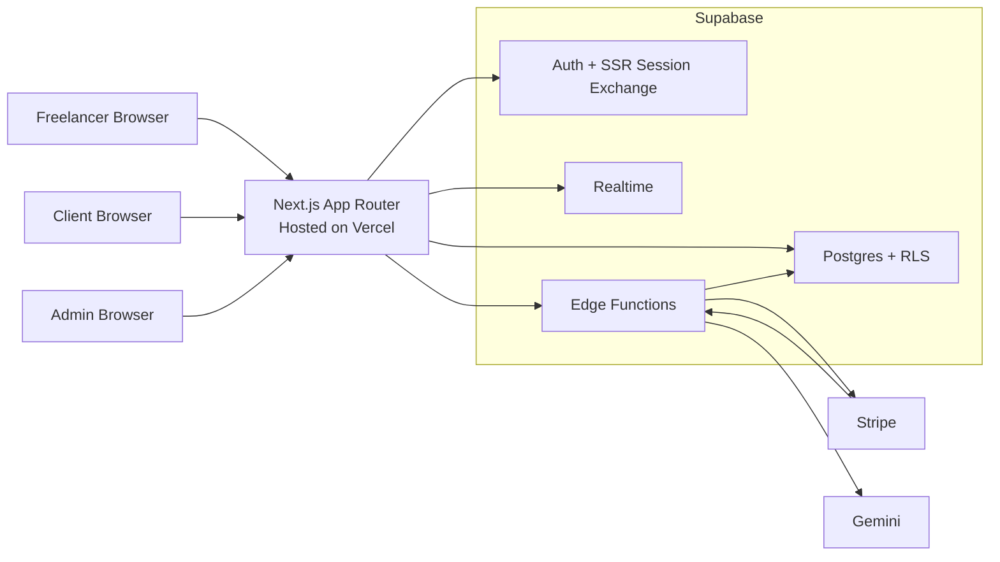
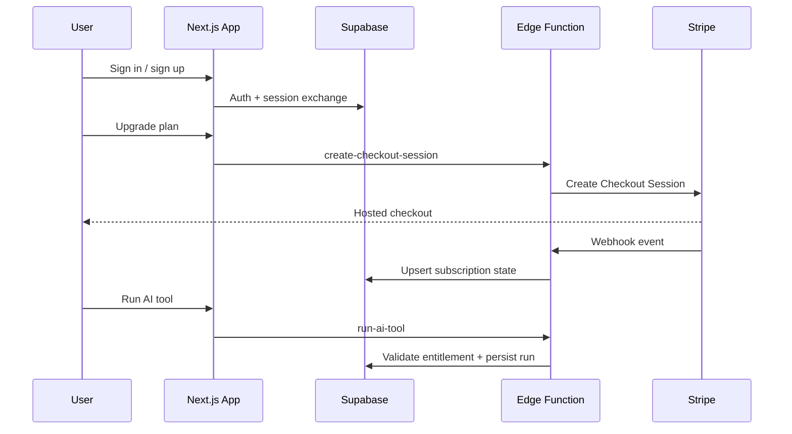

# AI Freelancer Ops

<p align="center">
  <strong>Backend-first SaaS case study built to demonstrate the hard parts of real product engineering.</strong>
</p>

<p align="center">
  Shared Supabase auth across multiple user surfaces, row-level security on a multi-tenant schema, Stripe subscription lifecycle sync, protected AI tooling behind server-side boundaries, and realtime collaboration from one workspace model.
</p>

<p align="center">
  <a href="https://ai-freelancer-ops.vercel.app">Live Demo</a>
  ·
  <a href="https://github.com/lachezarat/ai-freelancer-ops">GitHub Repo</a>
  ·
  <a href="./docs/case-study/contra-bam-case-study.md">Contra Case Study</a>
  ·
  <a href="#architecture">Architecture</a>
  ·
  <a href="#local-setup">Local Setup</a>
  ·
  <a href="#deployment">Deployment</a>
</p>

<p align="center">
  
  
  
  
  
  
  
</p>

## Why This Project Exists

AI Freelancer Ops is a portfolio-ready SaaS app designed to answer the questions hiring teams usually care about after the UI looks good:

- Can this engineer design and enforce real access boundaries?
- Can they separate trusted server-side operations from browser code?
- Can they integrate billing and entitlements without turning the data model into a mess?
- Can they reason about deployment topology instead of treating infrastructure as an afterthought?

This repo is intentionally optimized for those signals.

## What It Demonstrates

| Capability | What is implemented |
| --- | --- |
| Shared auth | Freelancer, client, and admin flows run from the same Supabase auth foundation |
| Access control | RLS-scoped workspaces, clients, projects, comments, deliverables, and tool runs |
| Billing lifecycle | Stripe checkout, customer portal, webhook sync, and subscription-aware entitlements |
| Protected AI tooling | Gemini requests are proxied through Supabase Edge Functions, never called directly from the browser |
| Realtime collaboration | Activity updates stream into workspace and portal surfaces through Supabase Realtime |
| Deployment split | Vercel serves the web app while Supabase owns data, auth, realtime, and functions |

## Product Surfaces

| Route | Purpose |
| --- | --- |
| `/workspace` | Freelancer dashboard for clients, projects, milestones, billing, and activity |
| `/portal` | Client review surface constrained to assigned work only |
| `/tools` | Protected AI tools with plan-aware gating and persisted run history |
| `/admin` | Internal visibility surface for platform-level inspection |

## Hiring Signal

This project is strongest as evidence for:

- Full-stack product engineering
- Backend-heavy frontend work
- SaaS platform development
- Authentication and authorization design
- Billing and entitlement systems
- Deployment-aware application architecture

## Contra Case Study

If you want to present this repo as a client-facing proof piece instead of a generic portfolio project, use these:

- [Case study for BAM-style backend roles](./docs/case-study/contra-bam-case-study.md)
- [Short application version](./docs/case-study/contra-bam-application.md)

Supporting visuals:

- [Architecture diagram](./docs/case-study/diagram-architecture.svg)
- [Subscription lifecycle diagram](./docs/case-study/diagram-lifecycle.svg)
- [Homepage screenshot](./docs/case-study/assets-home.png)
- [Sign-in screenshot](./docs/case-study/assets-sign-in.png)
- [Mobile screenshot](./docs/case-study/assets-home-mobile.png)

## Architecture



## End-To-End Flow



## Technical Highlights

- SSR session handling through Supabase so auth state survives navigation across app surfaces
- Multi-role access model with clear viewer resolution for freelancer, client, admin, and guest paths
- Subscription-aware feature gating enforced from both the UI layer and the trusted backend
- Stripe webhook-driven subscription state synchronization instead of optimistic client-only billing logic
- Server-side proxying for AI providers so API keys never enter browser-exposed code
- Realtime activity propagation layered on top of a relational data model instead of a demo-only event bus

## Stack

### Frontend

- Next.js 16 App Router
- React 19
- Tailwind CSS 4
- TypeScript

### Backend and platform

- Supabase Auth
- Supabase Postgres
- Supabase Row Level Security
- Supabase Realtime
- Supabase Edge Functions

### Integrations

- Stripe Billing
- Gemini via protected server-side proxy

## Local Setup

1. Install dependencies.

```bash
pnpm install
```

2. Copy the example env file and fill in real values.

```bash
cp .env.example .env.local
```

3. Start the app.

```bash
pnpm dev
```

4. If you want the local Supabase stack, start and seed it.

```bash
pnpm supabase:start
pnpm supabase:reset
```

Project resources:

- [`supabase/config.toml`](./supabase/config.toml)
- [`supabase/migrations/20260317223000_init.sql`](./supabase/migrations/20260317223000_init.sql)
- [`supabase/seed.sql`](./supabase/seed.sql)

## Environment Variables

The web app and the Supabase Edge Functions do not use the exact same env names. That split is intentional and matters in deployment.

| Variable | Scope | Purpose |
| --- | --- | --- |
| `NEXT_PUBLIC_APP_URL` | Vercel app | Canonical site URL used for redirects and callback generation |
| `NEXT_PUBLIC_SUPABASE_URL` | Vercel app | Public Supabase project URL |
| `NEXT_PUBLIC_SUPABASE_ANON_KEY` | Vercel app | Public anon key used by the web app |
| `SUPABASE_SERVICE_ROLE_KEY` | Vercel app and functions | Trusted server-side writes and admin operations |
| `STRIPE_SECRET_KEY` | Supabase functions | Stripe API access |
| `STRIPE_WEBHOOK_SECRET` | Supabase functions | Webhook signature verification |
| `STRIPE_PRICE_PRO` | Supabase functions | Stripe Price ID for the Pro plan |
| `STRIPE_PRICE_STUDIO` | Supabase functions | Stripe Price ID for the Studio plan |
| `STRIPE_PORTAL_RETURN_URL` | Supabase functions | Billing portal return URL |
| `GEMINI_API_KEY` | Supabase functions | Gemini API key |
| `GEMINI_MODEL_DEFAULT` | Supabase functions | Default model override |
| `GEMINI_MODEL_PREMIUM` | Supabase functions | Premium model override |

Reference: [`.env.example`](./.env.example)

## Deployment

### Vercel

Vercel hosts the Next.js application only.

Set these project env vars in Vercel:

- `NEXT_PUBLIC_APP_URL`
- `NEXT_PUBLIC_SUPABASE_URL`
- `NEXT_PUBLIC_SUPABASE_ANON_KEY`
- `SUPABASE_SERVICE_ROLE_KEY`

### Supabase

Supabase owns:

- Auth
- Postgres and RLS policies
- Realtime
- Edge Functions

Deploy these functions:

- `create-checkout-session`
- `create-customer-portal-session`
- `run-ai-tool`
- `stripe-webhook`

The Stripe webhook function is intentionally public and must remain reachable by Stripe.

### Stripe

Configure:

- one product and price for `Pro`
- one product and price for `Studio`
- billing portal access for the account
- a webhook endpoint pointed at the deployed `stripe-webhook` Supabase function

## Demo Accounts

When seeded locally, these demo accounts are available with password `Passw0rd!`:

- `admin@aifo.local`
- `maya@aifo.local`
- `olivia@northstar.local`
- `noah@flux.local`

## Verification

Run:

```bash
pnpm lint
pnpm typecheck
pnpm build
```

## Repo Map

| Path | Why it matters |
| --- | --- |
| `src/app/actions.ts` | Server actions for auth, CRUD, billing, and redirects |
| `src/lib/data/app-data.ts` | Surface data loading and viewer resolution |
| `src/lib/supabase/*` | Browser, server, middleware, and admin Supabase clients |
| `supabase/functions/run-ai-tool` | Protected Gemini proxy |
| `supabase/functions/create-checkout-session` | Stripe checkout orchestration |
| `supabase/functions/create-customer-portal-session` | Stripe billing portal handoff |
| `supabase/functions/stripe-webhook` | Stripe subscription lifecycle sync |

## Interview Talking Points

If you use this repo in a job application, the strongest engineering discussion points are:

- Why the app is split between Vercel and Supabase instead of trying to host everything in one place
- How RLS was used to support overlapping user roles without duplicating the entire data model
- Why Stripe subscription state is synchronized by webhook instead of trusting frontend success callbacks
- How AI providers are isolated behind Edge Functions so secrets and entitlements stay on trusted boundaries
- Where the current architecture is intentionally simple and where you would evolve it for production scale
