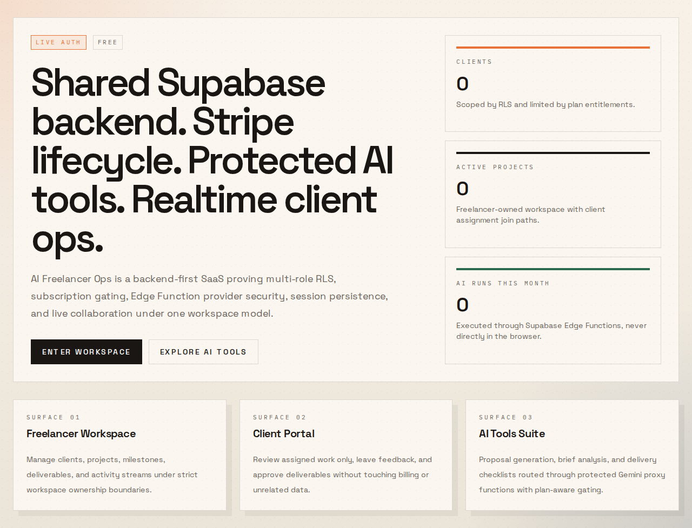
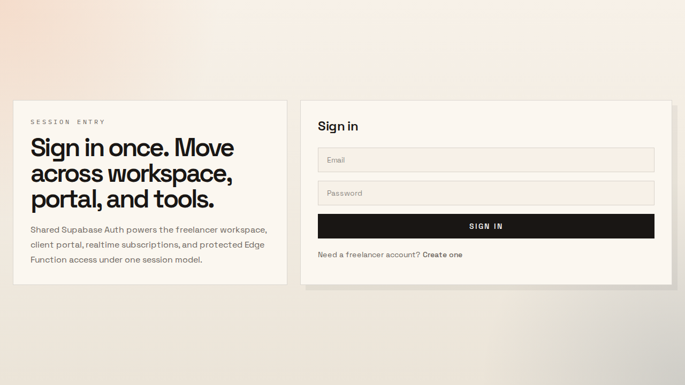
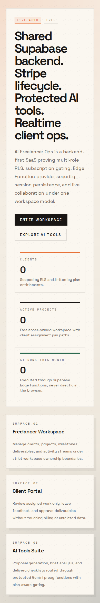
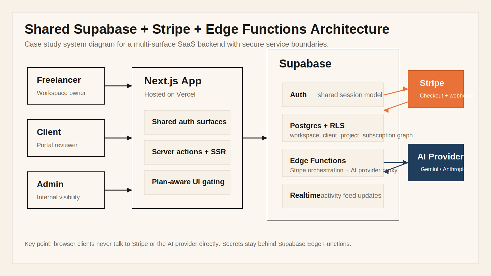
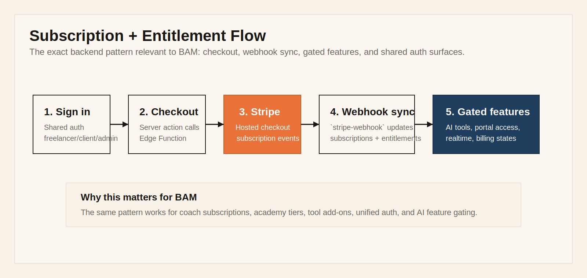

# AI Freelancer Ops

## Case Study: Shared SaaS Backend With Supabase RLS, Stripe Webhooks, and Edge Functions

## Project

AI Freelancer Ops is a backend-first SaaS case study built to demonstrate a specific combination of backend skills:

- multi-role Supabase auth on a shared instance
- row-level security across overlapping user types
- Stripe checkout + customer portal + webhook-driven subscription sync
- protected Edge Functions for trusted backend workflows
- realtime updates layered onto the same relational data model

Live app: https://ai-freelancer-ops.vercel.app  
GitHub repo: https://github.com/lachezarat/ai-freelancer-ops

## Why This Project Exists

The goal was to demonstrate the backend problems that usually decide whether a SaaS product is stable or fragile:

- multiple user roles on one Supabase instance
- subscription-aware entitlements
- webhook-driven billing truth
- server-side protection for AI providers and sensitive workflows
- deployable infrastructure split cleanly between Vercel and Supabase

That makes it directly relevant to backend roles that need:

- shared Supabase backend
- Stripe subscription lifecycle
- Edge Functions
- unified auth
- tool gating
- Realtime

## Visual Snapshot

### Live Homepage

### Shared Auth Entry

### Mobile Responsiveness

## How The System Works

### Architecture

### Billing + Entitlement Lifecycle

## Backend Scope I Shipped

### 1. Shared auth model across multiple surfaces

The app supports a **freelancer workspace**, **client portal**, and **admin surface** on one Supabase project. Instead of duplicating the backend per product surface, the system resolves the viewer role and workspace context from a shared auth/session layer.

That same pattern is useful anywhere multiple products or user surfaces need to share one backend while keeping access rules explicit.

### 2. Supabase RLS on a relational, multi-role schema

The data model is organized around workspace ownership, client assignment, projects, deliverables, comments, subscriptions, and AI/tool execution records. Access is constrained through RLS-oriented loading paths rather than trusting the frontend to decide what a user can see.

What this proves:

- I know how to design a shared schema where different user types need different slices of the same dataset.
- I understand that “Supabase auth” is not enough without real row-level boundaries.
- I think about access control as part of the schema and query model, not as an afterthought.

This is the same category of work behind coach accounts, player accounts, certification access, gated academy features, leaderboard visibility, and add-on tool permissions.

### 3. Stripe checkout, portal, and webhook synchronization

The app includes:

- server-triggered checkout session creation
- Stripe customer portal handoff
- webhook-driven subscription updates
- plan-aware entitlement checks that affect what a workspace can access

The important design choice is that **billing state is not trusted from frontend redirects**. The source of truth is the webhook sync that updates subscription data and access state in Supabase.

That is the same backend bar teams usually mean when they ask for:

- Stripe checkout + webhooks
- subscription lifecycle
- failed payments / cancellations / plan state
- tier gating across multiple surfaces

### 4. Edge Functions as the trust boundary

Sensitive operations are pushed behind Supabase Edge Functions, including:

- Stripe orchestration
- webhook handling
- AI provider calls

That matters because the frontend never gets direct access to:

- Stripe secrets
- service-role privileges
- AI provider API keys

This maps cleanly to work like:

- Stripe billing orchestration
- Anthropic API proxying
- API key migration to serverless
- secure add-on tool gating

The provider layer in this project currently uses Gemini, but the backend pattern is the real point. Swapping that boundary from Gemini to Anthropic is straightforward because the interface is already server-side and entitlement-aware.

### 5. Realtime layered onto the same backend

The app also includes a realtime activity feed so operational changes can flow through the workspace and portal surfaces without inventing a second backend model.

That is relevant anywhere the product needs:

- Supabase Realtime
- habit tracking
- leaderboards
- session persistence
- shared activity across platform areas

## Why This Is Relevant To BAM

For the **Backend Developer — Supabase + Stripe + Edge Functions** role at **Any Means Basketball**, the strongest overlap is:

1. **Shared Supabase instance with multiple products**  
   I already built a shared-backend pattern where different surfaces and user roles sit on one auth + data model and still maintain isolation.

2. **RLS with real role overlap**  
   This is not a single-role dashboard. The backend supports users who need access to the same system through different visibility rules.

3. **Stripe lifecycle handled on the backend**  
   Checkout, customer portal, webhook sync, and entitlement updates are already part of the shipped architecture.

4. **Edge Functions for trusted workflows**  
   Billing and AI calls already sit behind server-side boundaries, which is exactly the migration BAM wants for API keys and Anthropic integration.

5. **Realtime and stateful tools are not an afterthought**  
   The project already uses Realtime and persisted records in ways that map to coach/player tool state, progress views, and operational activity.

## Outcome

This project is live, deployed, and useful as proof that I can ship the full backend spine of a Supabase-first SaaS:

- schema-backed feature modeling
- auth and role resolution
- row-level access boundaries
- Stripe subscription lifecycle
- Edge Function trust boundaries
- production deployment on Vercel + Supabase

It is not just a mockup. It is a working system designed to prove the integration surface BAM is hiring for.

## How I Would Start BAM

The first sequence I would run is:

1. Validate the canonical schema and role assumptions against the real product flows.
2. Trace every Stripe-dependent entitlement to the actual backend records and webhook transitions.
3. Move remaining secret-bearing frontend calls behind Edge Functions.
4. Normalize the auth hub so Coaches, Academy, and Tool Suite share one durable identity layer.
5. Run a QA pass specifically around RLS leaks, subscription edge cases, and state persistence.

That is the fastest path to reducing product risk while still moving quickly.

## Short Version

I built and deployed a backend-first SaaS on **Supabase + Stripe + Vercel** that combines **multi-role RLS**, **Stripe checkout + webhook sync**, **Edge Functions**, **server-side AI routing**, and **Realtime** on one shared backend. That is the core reason I think this case study is relevant to BAM.
